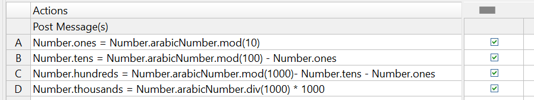
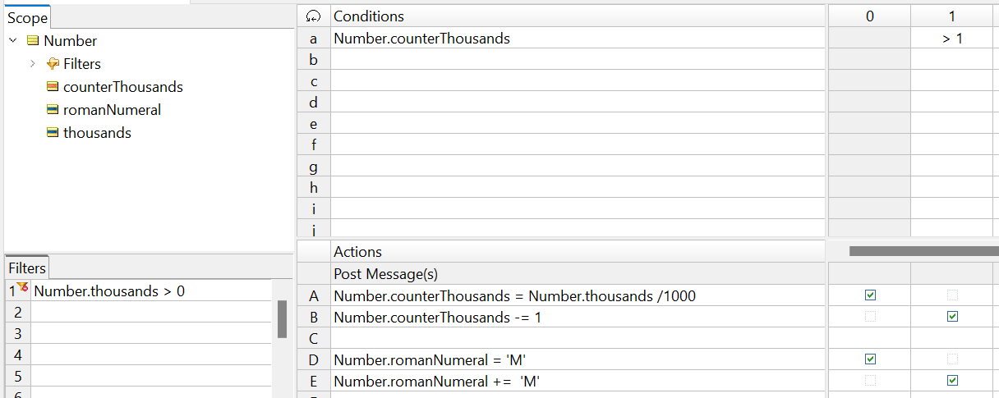
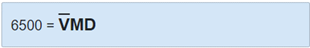

# Convert number to Roman numerals

This rule puzzle is focused on data transformation. This is pretty common in most rule implementations, albeit this puzzle is a bit atypical.

Create a rules project that converts any Arabic number to Roman numerals ([see here for more context](https://www.rapidtables.com/math/symbols/roman_numerals.html)). For example: input = “94” (either as an integer or as a string) and output = “XCIV”. Assume two scenarios where the original Arabic number is an Integer value, but also represented as a (separate) String value.

Perhaps the hardest part of this problem is “extracting” or “parsing” the place values – in other words, determining what number is in the “tens place” or the “hundreds place”. If our original Arabic input is 258, then it’s easy for us to see that we have 2 “hundreds”, 5 “tens” and 8 “ones”, or alternatively, 200 plus 50 plus 8. But how can the rules determine this?

If the original Arabic number is in integer form, then we use some calculations to extract the place values, as shown below:

These are all non-conditional rules. The are merely there to parse out the place values in an arbitrary number. In the case of row (rule) A, we set the `ones` attribute equal to the Arabic number mod 10, which is the same as dividing by 10 and keeping only the whole number remainder. For example, 94 mod 10 results in 4, and 258 mod 10 results in 8. 

The more detailed calculation for 94 mod 10 looks like this:

1.	Divide the integer by the divisor and round down: (94 / 10). round (0) = 9 = quotient
2.	Multiply the divisor by the quotient: 10 * 9 = 90
3.	Subtract this number from your initial number: 94 – 90 = 4
4.	The number you obtain (4) is the result of the modulo operation

Once we’ve extracted these place values, we can start assigning Roman numerals to each one:

In the rulesheet shown above, each number of “hundreds”, “tens” and “ones” is assigned a Roman equivalent – 200 is equivalent to CC, for example. This type of assignment is repeated for each place 
value, and then the Roman equivalents are “strung” together to produce the final answer. Note rule 1 
in which we initialize the value of the Roman literal to ‘. After all, the string building rule in action row
B can’t start with a null value (you can’t add a string value to a null value). That said, there maybe 
already be a “thousand” value present: we do that in a preceding rulesheet:

To convert a value above 1000, we need to assign ‘the ‘M’ Roman literal for each multiplier of 1000. 
Previously, large numbers were indicated by putting a horizontal line over them.

 

This implied multiplying the number by 1,000. Hence the V has a line over the top, which means 5,000. **This usage is no longer current**, because the largest numbers usually expressed in the 
Roman system are dates.

So, given current practice, we need to build up a string of ‘M’ characters to represents plurals of 
thousands. First, we apply a precondition to our rulesheet as we only want the entire sheet to fire if the Arabic input is over or equal to 1000. Then we calculate a `counterThousands` enabling us to iterate through rule 1 multiple times. For each multiplier of thousands, we can then assign a ‘M’ string whilst 
we decrement the counter (`counterThousands`) until the rule no longer fires (our stop condition).

We need to do one more thing: set the Processing Mode of our rulesheet to **“Advanced Inferencing 
with Self-Triggering”** as illustrated in the figure below.

Above is an example of single-rule loops, or loops caused by rules that depend logically on themselves, are also known as trivial loops, a special kind of loop because they consist of a single rule that successively revisits, or triggers, itself.

Finally, we need to string our rulesheets together in a ruleflow:

And we can test for a correct outcome. Glad we have an easier numbering system nowadays!

