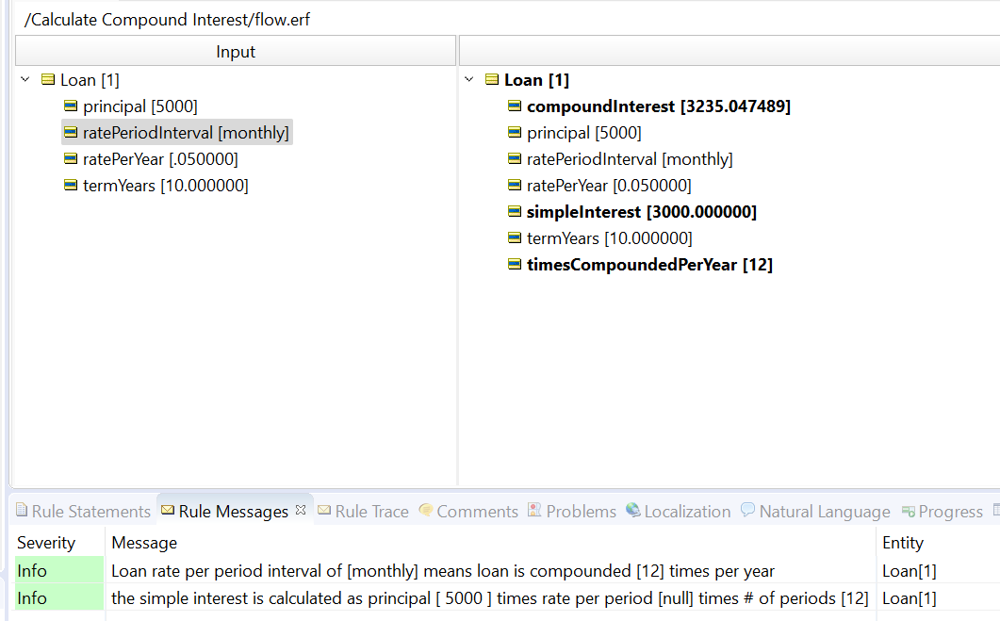

# The Miracle of Compound Interest

Calculate compound interest depending on type of compounding.

With these rules you can calculate what the value of X dollars will be in the future using various bank interest scenarios:
- Simple or Compound Interest
- If Compound, then over what frequency schedule: daily, monthly, annually?

