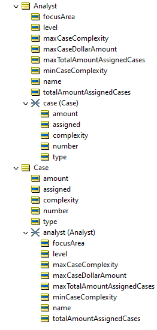
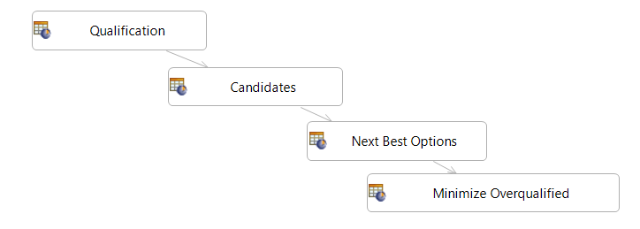
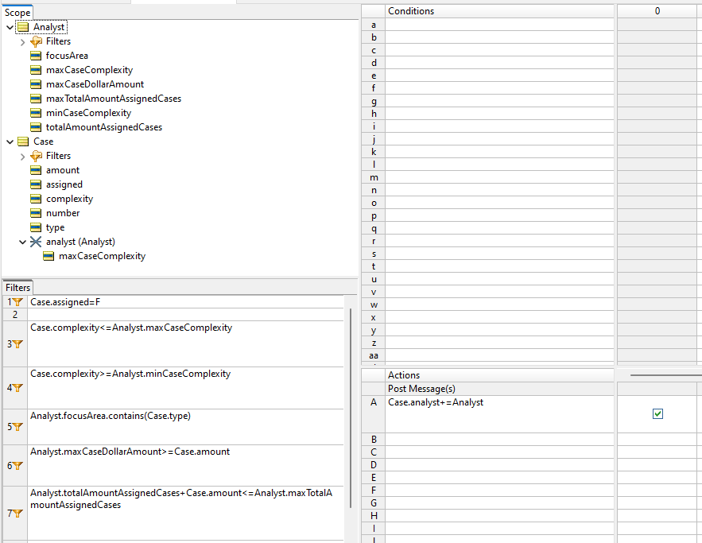

# Solving the [Case Assignment Challenge](https://dmcommunity.org/challenge/challenge-april-2025/) with Corticon: A Detailed Decision Modeling Walkthrough

## Relevant Corticon Concepts
-   **Rule Vocabulary:**
	- *Entities*: Represent business objects like "Case" and "Analyst," serving as data containers.  
	- *Attributes*: Define the characteristics of entities (e.g., `Case.amount`, `Analyst.level`, `Analyst.focusArea`).
  
    

-   **Rulesheets:** Group related rules to implement specific parts of the decision logic.
    
-   **Ruleflow:** Controls the order in which rulesheets are executed, orchestrating the overall decision-making process.
  
  
    
## Corticon Solution to Case Assignment Challenge

This solution uses a modular approach, dividing the logic into four Corticon rulesheets:

### 1.  **Qualification: Defining Analyst Capabilities**
    
   This rulesheet establishes the relationship between an analyst's level and the complexity of cases they can handle.
-   **Rule 1:**
    -   **Natural Language:** "If the case is not assigned, set the case assignment status to false."
    -   **Purpose:** Initializes the `Case.assigned` attribute to "F" (False) for new cases, ensuring they are considered for assignment.
-   **Rules 2-8:**
    -   These rules directly implement the analyst level to case complexity mapping from the challenge.

    .png>)

    

### 2.  Candidates: Identifying Eligible Analysts
    
  This rulesheet is the heart of the assignment process, identifying analysts who meet all the criteria for a specific case.
-   **Filters:**
    -   This rulesheet leverages filters. Filters are crucial in Corticon for efficiently narrowing down a set of entities (analysts, in this case) based on specific conditions.
    -   **Benefits of Filters:**
        Filters optimize rule execution by reducing the number of entities that rules need to evaluate. They clearly express the selection criteria, making the logic easier to understand. Changes to selection criteria are easily implemented by modifying filters.
    -   **Specific Filters:**
        -   `Case.assigned=F`: "The Case must not be assigned to any Analyst." This ensures that only unassigned cases are considered.
        -   `Case.complexity<=Analyst.maxCaseComplexity` and `Case.complexity>=Analyst.minCaseComplexity`: "The complexity of the Case must be less than or equal to/greater than or equal to the maximum/minimum case complexity that the Analyst can handle." These filters enforce the complexity matching requirement.
        -   `Analyst.focusArea.contains(Case.type)`: "The Analyst's focus area must include the type of the Case." This ensures focus area alignment.
        -   `Analyst.maxCaseDollarAmount>=Case.amount`: "The Analyst's maximum dollar amount allowed for cases must be greater than or equal to the amount of the Case." This enforces the case amount limit.
        -   `Analyst.totalAmountAssignedCases + Case.amount <= Analyst.maxTotalAmountAssignedCases`: "The total amount of cases assigned to the Analyst plus the amount of the new Case must not exceed the Analyst's maximum total amount assigned cases." This enforces the workload capacity constraint.
-   **Rule A0:**
    -   **Natural Language:** "Update the Case's analyst attribute to include the Analyst that meets the specified conditions."
    -   **Purpose:** Adds all the analysts that pass through the filters as potential candidates for the case.
    -   **Important:** At this stage, a case might have multiple candidate analysts.

    .png>)

    

### 3. Next Best Options: Minimizing Overqualification
    
   This rulesheet refines the selection when multiple analysts are eligible, choosing the analyst with the lowest level to minimize overqualification.
-   **Filters:**
    -   This rulesheet reuses the filters from "Candidates" to ensure only valid analysts are considered.
    -   `assignedAnalyst->isEmpty=T`: "The assigned analyst must currently be empty." This filter is crucial to make sure we are assigning the analyst only once
-   **Rule A0:**
    -   **Natural Language:** "This action assigns the first available analyst, sorted by their level, to the case. The assignment is made to the variable assignedAnalyst, which is updated to include the highest-level analyst from the list of available analysts."
    -   **Purpose:** This is the core logic for minimizing overqualification. It sorts the eligible analysts by their `level` (ascending order) and selects the first one (lowest level).
    -   **Corticon Expression:** `assignedAnalyst+=Analysts->sortedBy(level)->first`
    -   **Rationale:** This ensures that if, for example, both a level 5 and a level 9 analyst are qualified, the level 5 analyst will be chosen.

    .png>)

    

### 4.  Minimize Overqualified: Finalizing Assignment
    
This rulesheet completes the assignment process by updating the analyst's workload and marking the case as assigned.

-   **Filters:**
    -   `leastQualified.name=assignedAnalysts->sortedBy(level)->first.name`: "Assign alias of 'leastQualified' to the analyst that has been assigned as a potential match for a case who has the lowest qualification level." This filter ensures that only the least qualified analyst is considered for final assignment.
    -   `Case.assigned=F`: "Filter out instances of Case where Case.assigned is not False"
-   **Rule B0:**
    -   **Natural Language:** "Add the amount of a case to the total amount of assigned cases for the least overqualified matching analyst"
    -   **Purpose:** Updates the `totalAmountAssignedCases` attribute of the selected analyst to reflect the newly assigned case.
-   **Rule C0:**
    -   **Natural Language:** "Assign the case by setting its assigned attribute to true."
    -   **Purpose:** Sets the `Case.assigned` attribute to "T" (True), indicating that the case has been successfully assigned.
-   **Rule 1:**
    -   **Natural Language:** "Analyst's name is different from the least qualified analyst's name?"
    -   **Purpose:** This rule removes any analysts from the `assignedAnalysts` collection if they are not the least qualified analyst. This is a cleanup step to ensure data integrity.

    .png>)

    

## Rule Tests: Verifying the Solution

Rule tests are essential for validating the correctness of the decision service. 

-   **Sequential Test Sheets:** The test cases are structured as sequential test sheets ("Case 1," "Case 2," "Case 3," "Case 4"). This is important because each test sheet builds upon the state of the previous one. This means that assignments made in "Case 1" affect the available analysts and their workloads in "Case 2," and so on. This also allows you to test dependencies between case assignments. For example, assigning a high-value case early on might limit the availability of certain analysts for subsequent cases.
-   **Test Case Details:**
    -   Each test case defines the initial state of the analysts and the case to be assigned.
    -   The output section shows the result of executing the rules – which analyst is assigned to the case and how their workload is updated.
    -   The tests cover various scenarios, including different case types, complexities, and amounts, ensuring that the rules handle all situations correctly.
- **Rule Test Trace View:** Corticon's rule trace view provides valuable insights into the execution of the rules for each test case. By examining the trace, you can see exactly which rules were evaluated, which conditions were met, and which actions were executed, allowing for detailed debugging and verification of the decision logic. For instance, in 'Case 1,' the trace would show how the 'Qualification' rules assigned complexity ranges, followed by the 'Candidates' rules filtering analysts, and finally, the 'Minimize Overqualified' rules assigning the case to Kevin Jones and updating his workload.

### Ruletest - Assigning First Case

### Ruletest - Assigning Second Case

### Ruletest - Assigning Third Case

### Ruletest - Assigning Fourth Case
