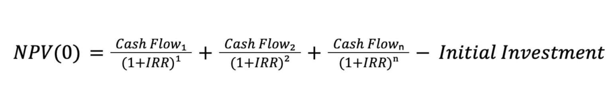
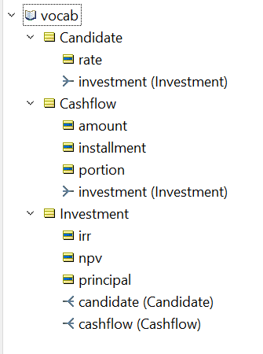
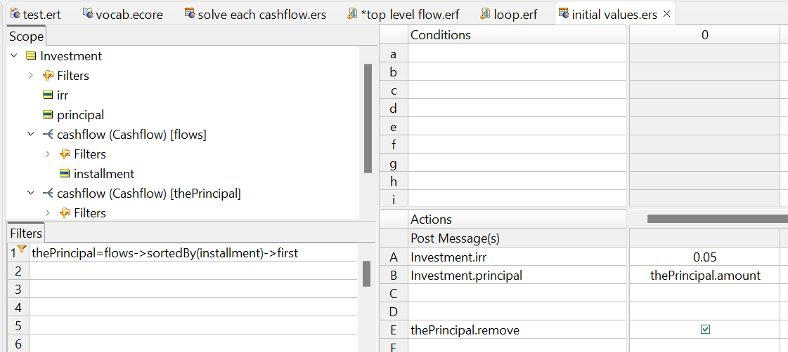
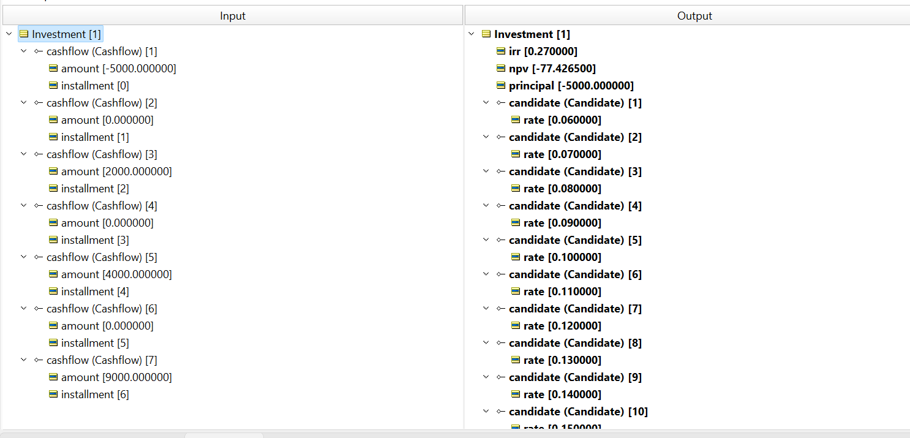
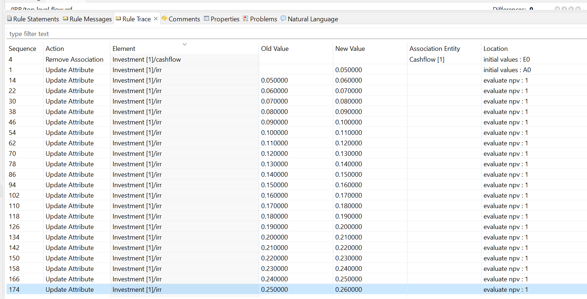
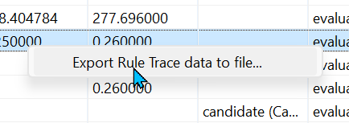

#  Internal Rate of Return

Using Corticon's iterative execution capabilities, we can solve calculations that require solving for the best possible answer. 

Internal Rate of Return (IRR) is a financial measure used, among other things, to evaluate the profitability and opportunity cost of an investment. A typical use case would be to evaluate whether to pursue an investment wherein:

* Initial expense (investment cost) of $5000
* Year 1 - $0 return
* Year 2 - $2000 return
* Year 3 - $0 return
* Year 4 - $4000 return
* Year 5 - $0 return
* Year 6 - $9000 return

The internal rate of return is solved for by using the formula:

Plugging in our numbers, we have: 

~0 = (0/(1+IRR)^1 + 2000/(1+IRR)^2 + 0/(1+IRR)^3 + 4000/(1+IRR)^4 + 0/(1+IRR)^5+ 9000/(1+IRR)^6) - 5000

We are seeking the IRR at which the Net Present Value (NPV) is zero (or as close as we can get within X number of decimal points). We thus need to recurringly try different values for IRR to get as close to zero as possible. 

## The Rules

First, our rule vocabulary. 

We have 3 entities, Candidate, Cashflow, and the root entity, Investment. The investment has any number of cashflows which we'll be evaluating. It also has any number of candidates that will be created during the decision execution, representing various rates that will be plugged in. 

The inputs will be simply the parent entity, Investment, with all corresponding cashflows and an installment number marking their sequence. The first cashflow is always the cash outflow, so its amount is thus always negative. It will use the value 0 for its installment number. 

Next our rules. 

* We start by initializing a value for IRR, which will be incremented up or down depending upon the resulting NPV. We likewise will slot the initial cashflow's value into the 'principal' attribute of the Investment entity, and then remove that cashflow to more easily operate upon only the future flows. 

* We'll drag this first rulesheet onto a new ruleflow which will be generated into the runtime decision service later on. A ruleflow can contain any number of rulesheets and any number of 'embedded' ruleflows. We're going to create an embedded ruleflow containing two more rulesheets, and loop through this embedded ruleflow as we try candidate IRR rates by applying the 'Iterative' option to it from the ruleflow pallet. 

* When an object on a ruleflow is set to iterate, it will repeatedly re-execute until the values derived by the object’s rules cease to change. Once values in the object cease changing, the iteration stops and execution continues to the next object (as determined by the Connectors). 
* Within the inner ruleflow, we have two rulesheets.
  

  
*  The first will calculate each individual cashflow's portion it contributes to the final calculation-- for example, the 'portion' attribute of cash flow 3 would be the result from 0/(1+IRR)^3.

* The second rulesheet in the embedded ruleflow will:
  * Set Investment.npv to the sum of each cashflow's portion less the initial investment
  * If that npv is greater than zero, increment the irr up by .01, or if less than zero, down by .01. 
  * However, we need to know if we've already tried a given rate or not so we don't end up in an endless loop. This is where the Candidates come in. We create a new candidate for each rate that we try, until we run into a rate that has already been tried, at which point no action is triggered an we return the calculated value. 

Testing against the top level ruleflow, we set the input based upon the use case listed above for the $5000 investment. We see that Corticon has settled on an IRR of .27 (27%).

When we run the ruletest with ruletrace, we can see how Corticon has looped through the rules with each tweaked rate until it got as close to zero for the investment's NPV as it could. 

The rule trace data can be exported to a CSV as well. If you'd like to see the exported trace data, its included within this repo and can be downloaded by clicking [here](images/ruletrace.csv). 

