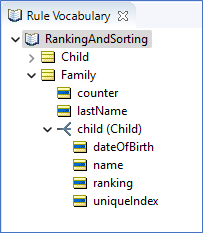
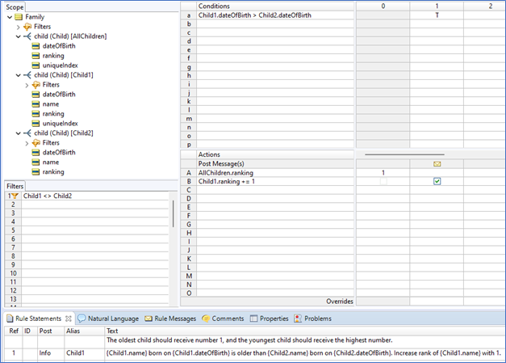
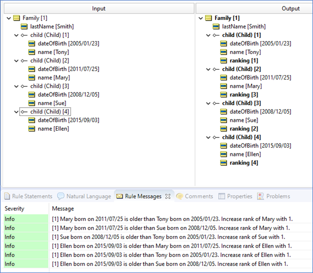
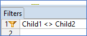
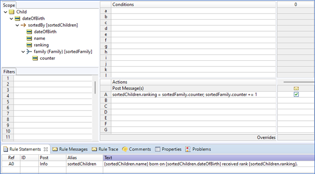
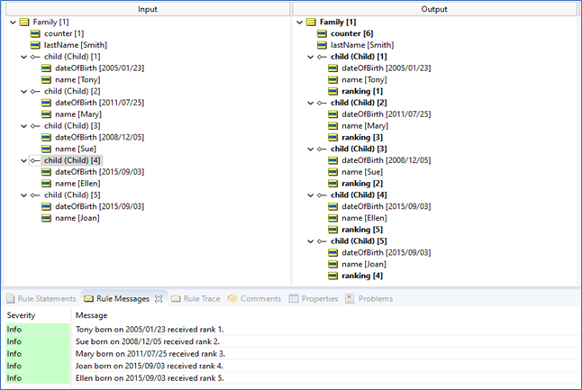
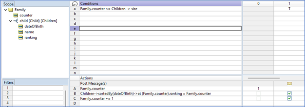
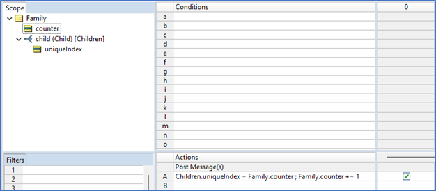
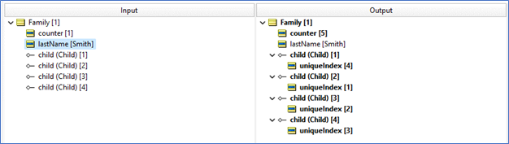

# Ranking and Ordering

Assume a family is comprised of several children. Use rules to assign each child a number based on his/her age. The oldest child should receive number 1, and the youngest child should receive the highest number. In a family of 5 children, for example, the youngest child should receive number 5. If there are twins, then they should receive the same number.

As a bonus, assign unique index numbers to the children when there’s no distinguishing data available. 

Ranking or ordering elements in a collection is a common requirement in business rules, whether handling claims in the order they were received, consuming the oldest inventory first, or basing a loan decision on the lowest credit score. The Corticon rule language and rulesheet modeling metaphor offer several ways to tackle the problem of ordering and ranking.

Although it may seem like a minor detail, the Puzzle’s caveat about how to handle ties is actually an important consideration when choosing a ranking approach: some approaches will result in ties having identical rankings and some will result in consecutive rankings. We’ll see some of each in the solutions that follow.

As with all rule modeling, we start with a Vocabulary. In this case, we can use a very simple Vocabulary, consisting of just two entities. 

`Child` has several attributes, but only `Name`, `dateOfBirth` and `uniqueIndex` will be used in our solutions.
`Family` primarily serves as the parent of the collection formed by the association with `Child`, but it also gives us a way to set collection-level attribute values such as counter, which is convenient in some solution approaches, as we will demonstrate.

## Multiple Alias Approach

You can see in the rulesheet below, `Child1` and `Child2` represent two copies of the same collection, `Family.child`. The `AllChildren` collection represents all children in the family.

Condition row 1 simply compares the `dateOfBirth` of a child in one collection to another child in the other collection. If the first collection’s child is older than the second’s, then we increment the second collection’s child ranking value. After all, the youngest child must receive the highest rank.

This means that the oldest child will “win” all comparisons with all other children, and therefore never have its index value incremented. It’ll remain 1, right where it was set by the initializing Nonconditional rule A1 for `AllChildren`. The youngest child, on the other hand, will “lose” all comparisons with all other children, and so its ranking value will be incremented for each loss. Therefore, the youngest child will have the highest value of ranking. 

This is the result, when we execute these rules against the children in this family:

There are two little wrinkles to the multiple alias approach: 1) what happens in a tie (e.g. with twins!), and 2) since we are comparing elements of two copies of the same collection, how do we prevent one child from being compared to its “mirror-image” in the other collection?

In the case of two children who share the same age (we took the more granular birthday), each child will “win” and “lose” the same number of comparisons with the other children, and so the ranking of both will be the same. But our ranking, although correct, ends up showing gaps: ranking of the next younger person will skip one or more rankings!

Similarly, if we allow one child to be compared to its mirror-image in the other collection, then we’re guaranteed to have a tie, so why bother making that comparison? We can prevent that “trivial” comparison from occurring by using the Filter shown in the Rulesheet. This doesn’t change the final outcome, but it allows us to arrive at that outcome faster, because fewer comparisons are made. In large collections, such an optimization can make a difference.

## Sorted Alias Approach

Another approach involves use of a **sorted alias**. Sorted aliases are unusual in that they are defined using sequence operators in the Scope section of the Rulesheet.

In the Rulesheet below, the Scope defines the `Children` collection. Then, we defined a second alias – a sorted alias – named `sortedChildren` and associated with this collection the (parent) Family entity (which we named `sortedFamily`).

How we did this? [See here.](https://docs.progress.com/bundle/corticon-rule-modeling/page/Sorted-aliases.html )

When the data represented by `sortedChildren` is processed by Nonconditional rule A1, the ranking value of the first child in the sorted collection (the oldest, since we’re sorting in ascending order by `birthdate`) is assigned the value of `sortedFamily.counter`, which we’ll need to ensure is initialized in the input test data. Then, before the next child (i.e., the next oldest child) is processed by A1, counter is incremented by 1.

Why is it necessary to join both ranking assignment and increment actions in the same row? Because if we had separated the two parts of A1 into two separate rows, then the natural iteration behavior of the Corticon rule engine would have assigned all children a ranking value of the same counter before incrementing. Then, after all ranking assignments were complete, the engine would have proceeded to the next row and incremented the counter once. By joining the two parts in a single row (using a semicolon ;), we ensure that counter is incremented immediately after one child’s index assignment and before the next.

A side effect of this approach: a sorted collection does not contain ties. Two elements of the sorted collection will have an order (one before the other) even if their sort criteria are equal. So, in the case of twins, we won’t be able to predict or control which is “before” and which is “after” . In some cases, this won’t matter: the first or last element in the sorted collection will definitely have sort indicies that are lowest or highest (respectively) even though there may be other elements that share that index. As shown in the output Testsheet to the right, Ellen and Joan have different ranking values even though their sort indicies (`birthdate`) are equal. It is very likely that re-executing this test would result in their index values reversing!

## Looping Approach

Unlike the sorted alias approach, which relies on the declarative nature of the Corticon rule language and the engine which processes it, the looping approach is decidedly procedural. By that, we mean our rules are designed to enforce a sort of “step-by-step” process during execution.

Loops contain rules that re-evaluate (and potentially re-execute) due to dependencies between them. A single rule can also form its own loop, meaning that the act of rule firing causes a change of state that in turn causes the rule to re-evaluate and potentially re-fire. The Rulesheet shown below contains an example of a rule that [“triggers” itself to fire again](https://docs.progress.com/bundle/corticon-rule-modeling/page/Types-of-loops.html).

When modeling procedural rules, it’s sometimes helpful to describe the process:
1.	If the `Family.counter` value is less than or equal to the number of elements in collection Children, then:
2.	sort the elements in (aliased collection) `Children` in descending order by `birthdate`, grab the one at sort position = counter and assign its ranking value = counter
3.	increment counter by 1
4.	go to step 1 and repeat (loop)

This loop or cycle will continue until `Family.counter` becomes greater than the number of elements in `Children` – in other words, until we run out of “little ones” to sort.

The output Testsheet is not shown because it is identical to that produced by the sorted alias approach, including the handling of ties.

For further details about the use of the “at ” operator, see [here](https://docs.progress.com/bundle/corticon-rule-language/page/At.html.). 

## Nothing to Sort

On occasion, you’ll want to assign unique ID or index numbers to elements in a collection that have no “sortable” attributes available. Or, you simply may not care how indicies are assigned, so long as all index numbers are unique. In these cases, you can use a slightly modified version of the sorted alias approach.

By dispending with the sorted alias, we ensure that elements of kids are processed by A1 in a completely random order. As modelers, we have no way of predicting or controlling which element is processed first by A1. But if we cared about the sequence, then we wouldn’t be using this approach in the first place!

Re-executing this Rulesheet will very likely result in a different set of index values each time. But the index values will be unique for each element. A test using indistinguishable (all attributes removed) kids elements illustrates this result.

As with any approach that makes use of an incrementing counter, be sure that the counter attribute is initialized with a real value (such as 0 or 1). In our examples, if counter has a null value, then the increment operator (+=) will not work!

The full solution can be downloaded from the Corticon GitHub repository.
